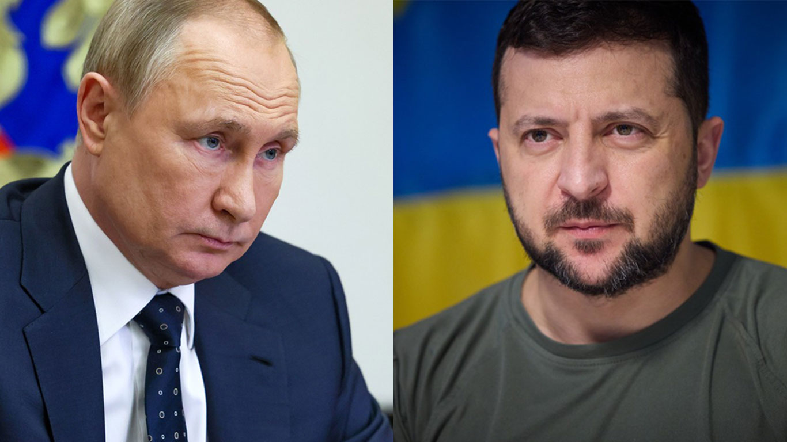

```{r setup, include=FALSE}
# https://stackoverflow.com/questions/67303576/rmarkdown-html-output-poor-resolution-in-different-browsers
# https://daraskolnick.com/image-dpi-web/
# https://yihui.org/knitr/options/#plots
knitr::opts_chunk$set(dpi = 300)
```

```{r load-packages, include=FALSE}
library(tidyverse)
library(tidyquant)
library(lubridate)
library(tidytext)
library(scales)
library(here)
```

# An Alarmed Zelenskyy vs. a Nonchalant Putin: Analyzing Ukrainian and Russian Press Releases

**Note:** *If you are interested in the dataset of press releases I scrapped from Zelenskyy's and Putin's websites, I posted it on [Kaggle](https://www.kaggle.com/datasets/peiyizhuo/zelenskyy-and-putin-press-releases). The scripts that I used to do the scraping are available on [Github](https://github.com/PeiYiZhuo/zelenskyy-putin/tree/main/r).*


Russian leader [Vladimir Putin](http://en.kremlin.ru/events/president/news/68454/photos) (right) and his Ukrainian counterpart [Volodymyr Zelenskyy](https://www.president.gov.ua/en/news/promova-prezidenta-ukrayini-v-parlamenti-sloveniyi-76369) (left)

Russia launched its full-scale invasion of Ukraine on February 24, 2022, turning a simmering conflict that had marred the region since 2014 into the largest war on European soil since the defeat of Nazi Germany. (For more context, I recommend this [New York Times article](https://www.nytimes.com/article/russia-ukraine-nato-europe.html) and this [piece from the Council on Foreign Relations](https://www.cfr.org/global-conflict-tracker/conflict/conflict-ukraine).) As the Ukrainian and Russian armed forces struggle against each other to gain the upper hand on the battlefield, the two governments are also prosecuting an information war for the hearts and minds of the world.

For a glimpse of how this parallel war of words is being waged, I decided to use the tools of data science to take a look at the English language press releases that the two countries have been producing prior to and after February 24. I obtained the data for this analysis by scraping the news sections of the English language websites of [the President of Ukraine](https://www.president.gov.ua/en/news/all) and [the Kremlin](http://en.kremlin.ru/events/president/news). The 1796 pieces I scraped are dated from October 24, 2021, four months prior to the invasion, to June 24, 2022, four months after the invasion.

> In the liberated areas of Ukraine, work continues to record and investigate war crimes committed by the Russian Federation. Almost every day new mass graves are found. Evidence is being gathered. Thousands and thousands of victims. Hundreds of cases of brutal torture. Human corpses are still found in manholes and basements. Tied up, mutilated bodies.
>
> <div style="text-align: right">
>
> Volodymyr Zelenskyy (April 12, 2022)
>
> <div>

<br>

> The special military operation is proceeding as planned. Of course, I am closely monitoring the discussion in our society and abroad. We must not keep anything from the public or keep anything secret; we must provide objective information about this combat operation.
>
> <div style="text-align: right">
>
> Vladimir Putin (April 12, 2022)
>
> <div>

According to my analysis, which is modeled after [David Robinson's analysis of Donald Trump's tweets](http://varianceexplained.org/r/trump-tweets/), Ukrainian President Volodymyr Zelenskyy's press releases demonstrate more concern about the war in Ukraine than do the press releases of the Kremlin. Since February 24, Zelenskyy has published press releases at a faster rate than Russian President Vladimir Putin and expressed more negative emotions in his releases than his Russian counterpart (who euphemistically refers to the war as a "special military operation"). I believe these differences in both the volume and the content of press releases illustrate the contrasting communication goals of the two wartime leaders: while Zelenskyy is raising the alarm about an existential threat to his country, Putin is downplaying the conflict.

```{r load-data, include=FALSE}
load(here("press_release_data", "zelenskyy.RData"))
load(here("press_release_data", "putin.RData"))
```

```{r combine-data, include=FALSE}
putin <- putin %>%
  mutate(
    # Combine press release summary with text
    body = ifelse(summary != "", paste(summary, body), body),
    origin = "Putin"
  ) %>%
  select(-c(location, summary))

zelenskyy <- mutate(zelenskyy, origin = "Zelenskyy") 

articles <- zelenskyy %>%
  rbind(putin) %>%
  mutate(
    # Combine headline with text
    text = ifelse(headline != "", paste(headline, body), body),
    after = date > ymd("2022-02-24")
  ) %>%
  select(-body)
```

<br>

## Press Release Volume Over Time

```{r releases-over-time, echo=FALSE}
pieces_by_day <- articles %>%
  mutate(date = date(date)) %>%
  count(date, origin)

start <- ymd("2021-10-24")
end <- ymd("2022-06-24")
diff <- end - start
all_dates <- tibble(
  date = start + rep(0:diff, each = 2),
  origin = rep(c("Putin", "Zelenskyy"), diff + 1)
)

pieces_by_day <- all_dates %>%
  left_join(pieces_by_day, by = c("date", "origin")) %>%
  mutate(n = ifelse(is.na(n), 0, n))

pieces_by_day %>%
  ggplot(aes(x = date, y = n, color = origin)) +
    geom_vline(xintercept = ymd("2022-02-24"), color = "black", linetype = "dashed") +
    annotate(
      "text", label = "Full-scale invasion begins",
      x = ymd("2022-03-22"), y = 6, size = 3
    ) +
    geom_ma(n = 30, linetype = "solid") + # https://www.r-bloggers.com/2021/04/ggplot-with-moving-averages/
    coord_x_date(xlim = c("2021-11-22", "2022-06-24")) +
    scale_x_date(date_breaks = "1 month", date_labels = "%b '%y") +
    labs(
      x = "Date",
      y = "Pieces",
      title = "Zelenskyy published more press releases than Putin after full-scale invasion",
      subtitle = "30-day moving average"
    ) +
    guides(color = guide_legend("")) +
    theme_minimal() +
    theme(legend.position = "bottom")
```

Initially, Putin produced more press releases than Zelenskyy, having been ahead by around one release in terms of the 30-day moving average in late November 2021. However, the two leaders reached parity prior to the full-scale invasion. After which, their rates of output diverged significantly. By late June 2022, Zelenskyy is publishing at a rate of around five per day while Putin looks to be around two pieces behind Zelenskyy at approximately 3 a day.

```{r date-ranking, include=FALSE}
zelenskyy_pieces_by_day <- pieces_by_day %>%
  filter(origin == "Zelenskyy") %>%
  add_column(
    rank = rank(-.$n, ties.method = "min")
  ) %>%
  arrange(rank) 

putin_pieces_by_day <- pieces_by_day %>%
  filter(origin == "Putin") %>%
  add_column(
    rank = rank(-.$n, ties.method = "min")
  ) %>%
  arrange(rank) 
```

Relatedly, February 24, 2022, which marks the start of Russia's full-scale invasion, is tied for Zelenskyy's fourth busiest day overall at 10 pieces. On the other hand, it is tied for Putin's 23rd busiest day overall at six pieces. In this particular case as in the general one above, Zelenskyy appears to exhibit a more dramatic response to the onset of the full-scale invasion than Putin.

<br>

## Mentions of "special military operation," "war," Ukraine, and Russia

Since the start of its full-scale invasion, Russia has refused to describe its war against Ukraine as a war, opting instead for the now infamous term of "special military operation." This well-known lexical omission, I discovered, is apparent in the Kremlin's English language press releases. I ascertained this fact by calculating how much more likely it was for Zelenskyy's press releases to use "war" and "special military operation" than it was for Putin's to do so. 

```{r words-trigrams, include=FALSE}
words <- articles %>%
  unnest_tokens(token, text) %>%
  filter(!token %in% stop_words$word)

# https://www.tidytextmining.com/ngrams.html#tokenizing-by-n-gram
# https://books.google.com/ngrams/info
trigrams <- articles %>%
  unnest_tokens(trigram, text, token = "ngrams", n = 3) %>%
  separate(trigram, c("word1", "word2", "word3"), sep = " ") %>%
  filter(
    !word1 %in% stop_words$word,
    !word2 %in% stop_words$word,
    !word3 %in% stop_words$word
  ) %>%
  unite(token, word1, word2, word3, sep = " ")

trigrams <- trigrams %>%
  filter(after == TRUE) %>%
  count(origin, token) %>%
  add_count(origin, wt = n, name = "total") %>%
  filter(token == "special military operation") 
```

```{r war-smo, fig.asp=0.6, echo=FALSE}
words %>%
  filter(after == TRUE) %>%
  count(origin, token) %>%
  add_count(origin, wt = n, name = "total") %>%
  filter(token %in% c("war", "security")) %>%
  rbind(trigrams) %>%
  .[nrow(.):1, ] %>%
  group_by(token) %>%
  do(tidy(poisson.test(.$n, .$total, alternative = "two.sided"))) %>%
  mutate(token = ifelse(token == "special military operation", "special military\noperation", token)) %>%
  ggplot(aes(x = estimate, y = reorder(token, estimate))) +
  geom_col() +
  geom_errorbar(aes(xmin = conf.low, xmax = conf.high), 
                width = 0.1, position = position_dodge(width = 0.9)) +
  geom_vline(xintercept = 1, linetype = "dashed", color = "red") +
  scale_x_continuous(breaks = 0:14) +
  annotate(
    "text", label = "Zelenskyy uses this term at roughly the same rate as Putin.",
    x = 5.4, y = 1.65, size = 3
  ) +
  labs(
    x = "Times more likely Zelenskyy is to use term", y = "",
    title = 'Zelenskyy is 11.5 times more likely than Putin to use the word "war"',
    subtitle = "Press releases from 2/24/2022 to 6/24/2022"
  ) +
  theme_minimal() +
  # https://felixfan.github.io/ggplot2-remove-grid-background-margin/
  theme(panel.grid.minor = element_blank())
```

After using the `unnest_tokens()` function from the tidytext package to create a table of words as well as a table of trigrams (combinations of three words), I eliminated stop words ("the", "and", "so", etc.) from each dataset. Next, I computed the rate at which each leader's press releases featured "war" and "special military operation" and used a Poisson test to conclude that indeed the differences between Zelenskyy and Putin are statistically significant. According to the plot above, Zelenskyy's press releases are around 11.5 times more likely than Putin's to use "war." Meanwhile, the former's likelihood of featuring "special military operation" is less than 2% that of the latter.

```{r ukraine-russia-1, include=FALSE}
cat("Mentions of Ukraine:\n")
# "ukraine", "ukraine's"
words %>%
  mutate(contains = str_detect(token, "ukraine")) %>%
  filter(contains) %>%
  pull(token) %>%
  unique()

cat("\nMentions of Ukrainians:\n")
# "ukrainians", "ukrainian", "ukrainianness"
words %>%
  mutate(contains = str_detect(token, "ukrainian")) %>%
  filter(contains) %>%
  pull(token) %>%
  unique()

cat("\nMentions of Russia and Russians:\n")
# "russians", "russia's", "russia", "russian", "helirussia",
# "onamendmentstothecriminalcodeoftherussianfederationandarticles",
# "ofthecriminalprocedurecodeoftherussianfederation"
words %>%
  mutate(contains = str_detect(token, "russia")) %>%
  filter(contains) %>%
  pull(token) %>%
  unique()

# Mentions of Ukraine
ukraine <- c("ukraine", "ukraine's", "ukrainians", "ukrainian", "ukrainianness")
# Mentions of Russia
russia <- c("russians", "russia's", "russia", "russian", "helirussia",
            "onamendmentstothecriminalcodeoftherussianfederationandarticles",
            "ofthecriminalprocedurecodeoftherussianfederation")
```

```{r ukraine-russia-2, fig.asp = 0.85, echo=FALSE}
words %>%
  mutate(
    country = case_when(
      token %in% ukraine ~ "Ukraine",
      token %in% russia ~ "Russia",
      TRUE ~ NA_character_
    )
  ) %>%
  count(country, origin, after) %>%
  add_count(origin, after, wt = n, name = "total") %>%
  filter(country %in% c("Ukraine", "Russia")) %>%
  .[nrow(.):1, ] %>%
  group_by(country, origin) %>%
  do(tidy(poisson.test(.$n, .$total, alternative = "two.sided"))) %>%
  ggplot(aes(x = origin, y = estimate, fill = country)) +
  geom_col(position = "dodge") +
  geom_errorbar(aes(ymin = conf.low, ymax = conf.high), 
                width = 0.1, position = position_dodge(width = 0.9)) +
  geom_hline(yintercept = 1, linetype = "dashed", color = "black") +
  # https://intellipaat.com/community/16371/how-to-left-align-text-in-annotate-from-ggplot2#:~:text=1%20Answer&text=To%20left%2Dalign%20text%20in,and%201%20means%20right%2Djustified.
  annotate("text", label = "No change after\nfull-scale invasion",
           x = 2.62, y = 1, size = 3, hjust = 0) +
  coord_cartesian(clip = "off", xlim = c(1, 2)) +
  labs(
    x = "", y = "Times more likely country mentioned post-invasion",
    title = paste0(
      "Zelenskyy increased mentions of Russia far more than Putin", 
      "\nincreased mentions of Ukraine since full-scale invasion"
    )
  ) +
  guides(fill = guide_legend("")) +
  theme_minimal() 
```

The above plot depicts, for Zelenskyy and Putin, changes in their likelihood of mentioning their own as well as their counterpart's country (either a reference to Ukraine/Ukrainians or Russia/Russians). After February 24, 2022, the Kremlin's press releases increased their likelihood of mentioning Ukraine by around 18%. Meanwhile, the likelihood of Zelenskyy mentioning Russia quadrupled after that date. (For both sides, however, the likelihood of mentioning their own country slightly decreased from where it was pre-invasion.) The extent of Zelenskyy's increase relative to Putin's reinforces the contrast between their communication strategies: While the start of the invasion coincided with a transformation in Zelenskyy's messaging, the situation was far less dramatic on Putin's side.

<br>

## Sentiment Analysis

```{r add-sentiments, include=FALSE}
# https://www.tidytextmining.com/sentiment.html
nrc <- get_sentiments("nrc")
words <- words %>%
  add_count(origin, after, name = "total") %>%
  left_join(nrc, by = c("token" = "word")) %>%
  count(origin, after, sentiment, total, name = "number") %>%
  filter(!is.na(sentiment)) 
```

Since the full-scale invasion of Ukraine, Zelenskyy's press releases have increased by a greater extent in both volume and mentions of the opposing side than statements from the Kremlin. Using the table of words created in the previous section, I conducted a sentiment analysis using Poisson tests (along the same lines as [the one that David Robinson](http://varianceexplained.org/r/trump-tweets/) performed on iPhone and Android tweets from Donald Trump's Twitter timeline) and found further evidence of a divergence between Putin and Zelenskyy after February 24, 2022.

```{r sentiment-poisson-1, echo=FALSE, warning=FALSE}
words %>%
    mutate(after = ifelse(after, "Post-Invasion", "Pre-Invasion")) %>%
    group_by(origin, sentiment) %>%
    # https://www.datasciencemadesimple.com/reverse-the-order-of-dataframe-row-wise-2/
    .[nrow(.):1, ] %>%
    do(tidy(poisson.test(.$number, .$total))) %>%
    mutate(across(c(estimate, starts_with("conf")), ~ . - 1)) %>%
    ggplot(aes(x = estimate, y = reorder(sentiment, estimate), color = origin)) +
    geom_vline(xintercept = 0, linetype = "dashed", color = "black") +
    geom_point() +
    geom_errorbar(aes(xmin = conf.low, xmax = conf.high), width = 0.1) +
    scale_x_continuous(labels = label_percent()) +
    labs(
      x = "Change from pre-invasion to post-invasion",
      y = "Sentiment",
      title = paste0("Zelenskyy press releases experienced a more dramatic",
                     "\nshift in negative sentiments following full-scale invasion")
    ) +
    guides(color = guide_legend("")) +
    theme_minimal() +
    theme(
       # https://stackoverflow.com/questions/20609716/changing-format-of-some-axis-labels-in-ggplot2-according-to-condition
      axis.text.y = element_text(face = c(rep("plain", 5), rep("bold", 5)))
    )
```

As can be seen above, post-invasion press releases from Zelenskyy are much more likely to use words that connote disgust (141% more likely), sadness (138% more likely), negativity (118% more likely), anger (113% more likely), and fear (107% more likely) than those from before the invasion. By contrast, the sentiment of Putin's press releases have not changed by nearly as much. The largest change for Russian press releases is in their use of joyful words, which increased 11% post-invasion. However, this is exceeded by a 45% increase on the Ukrainian side within the same sentiment.

To examine this phenomenon from a different angle, let us compare how much Zelenskyy's and Putin's press releases differed prior to the invasion versus after.

```{r sentiment-poisson-2, echo=FALSE, warning=FALSE}
words %>%
    mutate(after = ifelse(after, "Post-Invasion", "Pre-Invasion")) %>%
    group_by(after, sentiment) %>%
    # https://www.datasciencemadesimple.com/reverse-the-order-of-dataframe-row-wise-2/
    .[nrow(.):1, ] %>%
    do(tidy(poisson.test(.$number, .$total))) %>%
    mutate(across(c(estimate, starts_with("conf")), ~ . - 1)) %>%
    ggplot(aes(x = estimate, y = reorder(sentiment, estimate), color = after)) +
    geom_vline(xintercept = 0, linetype = "dashed", color = "black") +
    geom_point() +
    geom_errorbar(aes(xmin = conf.low, xmax = conf.high), width = 0.1) +
    scale_x_continuous(labels = label_percent()) +
    labs(
      x = "Change from Putin to Zelenskyy",
      y = "Sentiment",
      title = paste0("Zelenskyy press releases diverged in sentiment (especially",
                     "\nanger) from Putin press releases following full-scale invasion")
    ) +
    guides(color = guide_legend("Time period")) +
    theme_minimal() +
    theme(
       # https://stackoverflow.com/questions/20609716/changing-format-of-some-axis-labels-in-ggplot2-according-to-condition
      axis.text.y = element_text(face = c(rep("plain", 9), "bold"))
    )
```

As you had probably expected, Zelenskyy's press releases was much more likely to use negative words relative to Putin's during the period after February 24. Prior to the full-scale invasion, neither leader expressed all five negative sentiments more than the other. Putin's press releases were more likely to use words associated with disgust, negativity, and sadness while Zelenskyy's were more likely to use angry and fearful words. However, after the Russian invasion, Zelenskyy's pieces became much more likely to use words associated with every one of these sentiments. Of particular note is the extent, at nearly 3 times the rate of the Kremlin, to which press releases from Zelenskyy became more likely to use angry words.

<br>

## A Study of Contrasts in Wartime Messaging

Zelenskyy's outrage in contrast to Putin's blasé attitude is consistent with the circumstances in which the two leaders find themselves. Putin intended for the conflict to be a swift one in which [the Ukrainian defenders buckle before his superior military](https://www.vox.com/22954833/russia-ukraine-invasion-strategy-putin-kyiv), so the Russian leader opted for a messaging strategy that gives off an air of competence and nonchalance. On the opposing side, given the sudden state of emergency into which his country has been plunged, it makes sense that Zelenskyy would double down on communicating negative sentiments. Undoubtedly, Zelenskyy needs international support more so than Putin does, and strong language is apt to alert foreign countries to the severity of Ukraine's plight.

Putin has been described by former Secretary of State Henry Kissinger as ["aloof."](https://podcasts.google.com/feed/aHR0cHM6Ly93d3cub21ueWNvbnRlbnQuY29tL2QvcGxheWxpc3QvZDgzZjUyZTQtMjQ1NS00N2Y0LTk4MmUtYWI3OTAxMjBiOTU0LzUxNTU5MDhmLWE1MTUtNGJiZi1hYTEzLWFiODYwMGNlYzk1NC9hZTUyMjRiMy05ZWJiLTQ1YzItYmI1Zi1hYjg2MDBjZWM5NTkvcG9kY2FzdC5yc3M/episode/MTQxZmVmNzAtMjU2ZC00NDMwLWFhMWItYWVjZTAxMDRhNDVi?sa=X&ved=0CAYQuIEEahcKEwjItpm8qPL4AhUAAAAAHQAAAAAQAQ) Meanwhile, Zelenskyy's defiance has been likened to that shown by [British Prime Minister Winston Churchill against Adolf Hitler](https://www.nytimes.com/2022/03/23/opinion/zelensky-churchill.html). Indeed, as my analysis has shown, whereas Putin is cold and distant, Zelenskyy is fiery and passionate.

<br>

## Acknowledgements

This project came out of the work I did for a group project in Statistical Science 323 at Duke University. The other members of my group were Rivca Chaver, Emma Runia, Emma Friesen, and Shine Wu. 

<br>

## Note on Licenses

The content of the websites of the President of Ukraine and the Kremlin are licensed under a [Creative Commons Attribution 4.0 International license](https://creativecommons.org/licenses/by/4.0/deed.en). The photos of [Putin](http://en.kremlin.ru/events/president/news/68454/photos) and [Zelenskyy](https://www.president.gov.ua/en/news/promova-prezidenta-ukrayini-v-parlamenti-sloveniyi-76369) in the collage above are taken from their respective websites.

<br>

---

## Resources

-   [NRC lexicon](https://onlinelibrary.wiley.com/doi/abs/10.1111/j.1467-8640.2012.00460.x)
-   [RMarkdown formatting tips](https://intro2r.com/r-markdown-anatomy.html)
-   [More RMarkdown formatting tips](https://bookdown.org/yihui/rmarkdown/markdown-syntax.html)
-   [Block quotes](https://commonmark.org/help/tutorial/05-blockquotes.html)
-   [Concealing code blocks](https://bookdown.org/yihui/rmarkdown-cookbook/hide-one.html)
-   [Right-justifying text](https://stackoverflow.com/questions/35077507/how-to-right-align-and-justify-align-in-markdown#:~:text=Allow%20markdown%20tables%20to%20specify,to%20default%20to%20right%20alignment.)
-   [Figure aspect ratios](https://sebastiansauer.github.io/figure_sizing_knitr/)
-   [Images in RMarkdown](https://www.earthdatascience.org/courses/earth-analytics/document-your-science/add-images-to-rmarkdown-report/)
-   [Collages in Photoshop](https://digital-photography-school.com/make-photoshop-collage-9-steps/)

<br>
