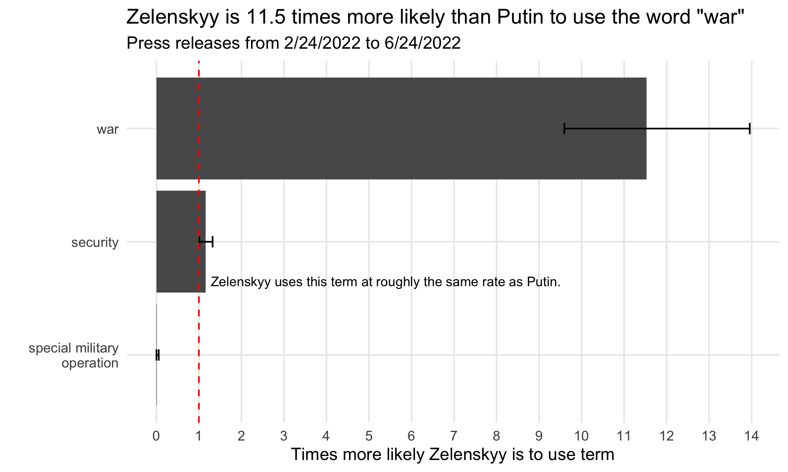
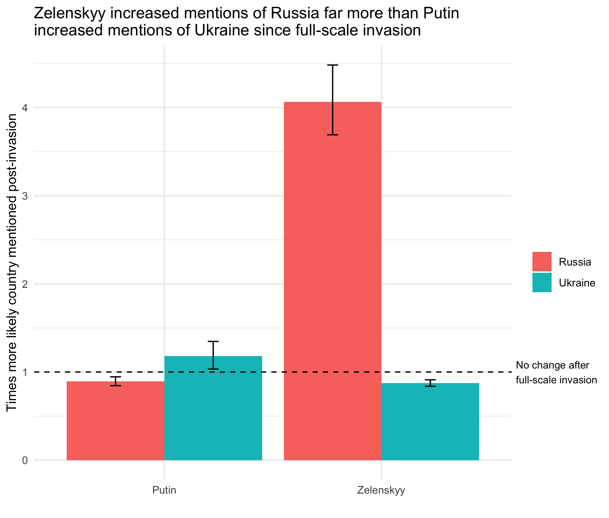
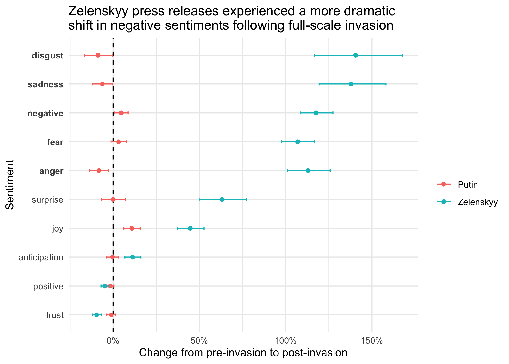
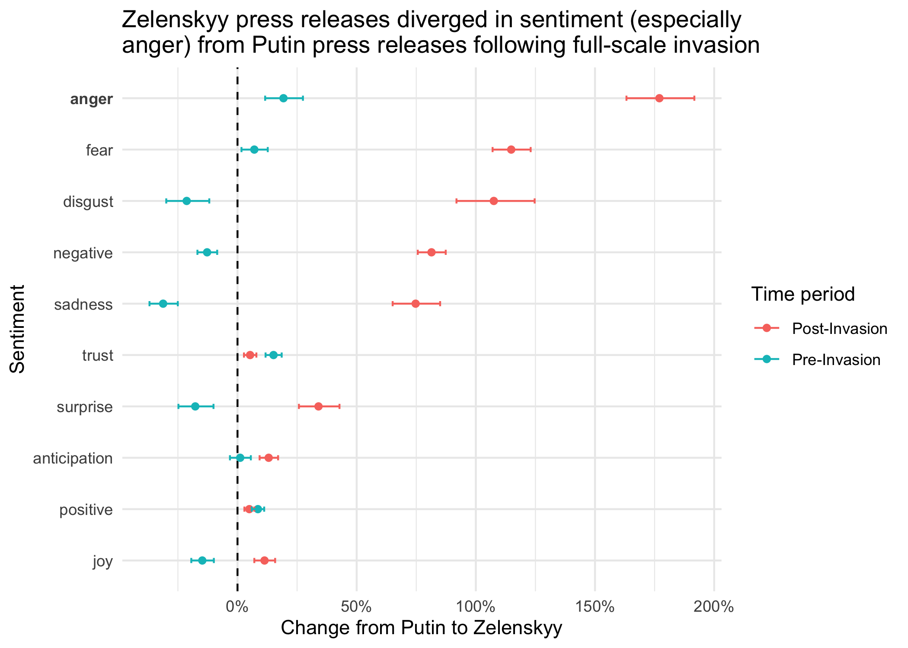

# An Alarmed Zelenskyy vs. a Nonchalant Putin: Analyzing Ukrainian and Russian Press Releases

 

Russian
leader [Vladimir
Putin](http://en.kremlin.ru/events/president/news/68454/photos) on the
right and his Ukrainian counterpart [Volodymyr
Zelenskyy](https://www.president.gov.ua/en/news/promova-prezidenta-ukrayini-v-parlamenti-sloveniyi-76369)
on the left

 

**Note:** *If you are interested in the datasets of press releases I
scrapped from Zelenskyy’s and Putin’s websites, I posted them on
[Kaggle](https://www.kaggle.com/datasets/peiyizhuo/zelenskyy-and-putin-press-releases?select=putin.csv).
The scripts that I used to do the scraping are available on
[Github](https://github.com/PeiYiZhuo/zelenskyy-putin/tree/main/r).*

Russia launched its full-scale invasion of Ukraine on February 24, 2022,
turning a simmering conflict that had marred the region since 2014 into
the largest war on European soil since the defeat of Nazi Germany. (For
more context, I recommend this [New York Times
article](https://www.nytimes.com/article/russia-ukraine-nato-europe.html)
and this [piece from the Council on Foreign
Relations](https://www.cfr.org/global-conflict-tracker/conflict/conflict-ukraine).)
As the Ukrainian and Russian armed forces struggle against each other to
gain the upper hand on the battlefield, the two governments are also
prosecuting an information war for the hearts and minds of the world.

For a glimpse of how this parallel war of words is being waged, I
decided to use the tools of data science to take a look at the English
language press releases that the two countries have been producing prior
to and after February 24. I obtained the data for this analysis by
scraping the news sections of the English language websites of [the
President of Ukraine](https://www.president.gov.ua/en/news/all) and [the
Kremlin](http://en.kremlin.ru/events/president/news). The 1797 pieces I
scraped are dated from October 24, 2021, four months prior to the
invasion, to June 24, 2022, four months after the invasion.

 

> In the liberated areas of Ukraine, work continues to record and
> investigate war crimes committed by the Russian Federation. Almost
> every day new mass graves are found. Evidence is being gathered.
> Thousands and thousands of victims. Hundreds of cases of brutal
> torture. Human corpses are still found in manholes and basements. Tied
> up, mutilated bodies.
>
> 

>
> Volodymyr Zelenskyy (April 12, 2022)
>
> 

 

> The special military operation is proceeding as planned. Of course, I
> am closely monitoring the discussion in our society and abroad. We
> must not keep anything from the public or keep anything secret; we
> must provide objective information about this combat operation.
>
> 

>
> Vladimir Putin (April 12, 2022)
>
> 

 

According to my analysis, which is modeled after [David Robinson’s
analysis of Donald Trump’s
tweets](http://varianceexplained.org/r/trump-tweets/), Ukrainian
President Volodymyr Zelenskyy’s press releases demonstrate more concern
about the war in Ukraine than do the press releases of the Kremlin.
Since February 24, Zelenskyy has published press releases at a faster
rate than Russian President Vladimir Putin and expressed more negative
emotions in his releases than his Russian counterpart (who
euphemistically refers to the war as a “special military operation”). I
believe these differences in both the volume and the content of press
releases illustrate the contrasting communication goals of the two
wartime leaders: while Zelenskyy is raising the alarm about an
existential threat to his country, Putin is downplaying the conflict.

## Press Release Volume Over Time

<!-- -->

Initially, Putin produced more press releases than Zelenskyy, having
been ahead by around one release in terms of the 30-day moving average
in late November 2021. However, the two leaders reached parity just
prior to the full-scale invasion. After which, their rates of output
diverged significantly. By late June 2022, Zelenskyy is publishing at a
rate of around five per day while Putin looks to be around two pieces
behind Zelenskyy at approximately 3 a day.

Relatedly, February 24, which marks the start of Russia’s full-scale
invasion, is tied for Zelenskyy’s fourth busiest day overall at 10
pieces. On the other hand, it is tied for Putin’s 23rd busiest day
overall at six pieces. In this particular case as in the general one
above, Zelenskyy appears to exhibit a more dramatic responsive to the
onset of the full-scale invasion than Putin.

## Mentions of “special military operation,” “war,” Ukraine, and Russia

Since the start of its full-scale invasion, Russia has refused to
describe its war against Ukraine as a war, opting instead for the now
infamous term of “special military operation.” This well-known lexical
omission, I discovered, is apparent in the Kremlin’s English language
press releases. I ascertained this fact by calculating how much more
likely it was for Zelenskyy’s press releases to use “war” and “special
military operation” than it was for Putin’s to do so.

<!-- -->

After using the `unnest_tokens` function from the `tidytext` package to
create a dataset of words as well as a dataset of trigrams (combinations
of three words), I eliminated stop words (“the”, “and”, “so”, etc.) from
each dataset. Next, I computed the rate at which each leader’s press
releases featured “war” and “special military operation” and used a
Poisson test to conclude that indeed the differences between Zelenskyy
and Putin are statistically significant. According to the plot above,
Zelenskyy’s press releases are around 11.5 times more likely than
Putin’s to use “war.” Meanwhile, the former’s likelihood of featuring
“special military operation” is less than 2% that of the latter.

<!-- -->

The above plot depicts, for Zelenskyy and Putin, changes in their
likelihood of mentioning their own as well as their counterpart’s
country (either a reference to Ukraine/Ukrainians or Russia/Russians).
After February 24, 2022, the Kremlin’s press releases increased their
likelihood of mentioning Ukraine by around 18%. Meanwhile, the
likelihood of Zelenskyy mentioning Russia quadrupled after that date.
(For both sides, however, the likelihood of mentioning their own country
slightly decreased from where it was pre-invasion.) The extent of
Zelenskyy’s increase relative to Putin’s reinforces the contrast between
their communication strategies: While the start of the invasion
coincided with a transformation in Zelenskyy’s messaging, Putin’s change
has been far less dramatic.

### Sentiment Analysis

Since the full-scale invasion of Ukraine, Zelenskyy’s press releases
have increased by a greater extent in both volume and mentions of the
opposing side than statements from the Kremlin. Using the dataset of
words created in the previous section, I conducted a sentiment analysis
using Poisson tests (along the same lines as [the one that David
Robinson](http://varianceexplained.org/r/trump-tweets/) performed on
iPhone and Android tweets from Donald Trump’s Twitter timeline) and
found further evidence of a divergence between Putin and Zelenskyy after
February 24, 2022.

<!-- -->

As can be seen above, post-invasion press releases from Zelenskyy are
much more likely to use words that connote disgust (140% more likely),
sadness (138% more likely), negativity (118% more likely), anger (113%
more likely), and fear (107% more likely) than those from before the
invasion. By contrast, the sentiment of Putin’s press releases have not
changed by nearly as much since the start of the invasion. The largest
change for Russian press releases is in their use of joyful words, which
increased 11% post-invasion. However, this is exceeded by a 45% increase
on the Ukrainian side.

To examine this same phenomenon from a different angle, let’s compare
how much Zelenskyy’s and Putin’s press releases differed prior to the
invasion versus after.

<!-- -->

As you had probably expected, Zelenskyy’s press releases was much more
likely to use negative words relative to Putin’s during the period after
February 24. Prior to the full-scale invasion, neither leader expressed
all five negative sentiments more than the other. Putin’s press releases
were more likely to use words associated with disgust, negativity, and
sadness while Zelenskyy’s were more likely to use angry and fearful
words. However, after the Russian invasion, Zelenskyy’s pieces became
much more likely to use words associated with every one of these
sentiments. Of particular note is the extent, at nearly 3 times the rate
of the Kremlin, to which press releases from Zelenskyy became more
likely to use angry words.

### A Study of Contrasts in Wartime Messaging

Zelenskyy’s outrage in contrast to Putin’s blasé attitude is consistent
with the circumstances in which the two leaders find themselves. Putin
intended for the conflict to be a swift one in which [his superior
military easily defeats the Ukrainian
defenders](https://www.vox.com/22954833/russia-ukraine-invasion-strategy-putin-kyiv),
so the Russian leader opts for a messaging strategy that gives off an
air of competence and nonchalance. On the opposing side, it makes sense
that Zelenskyy, given the sudden state of emergency into which his
country has been plunged, would double down on communicating negative
sentiments. Undoubtedly, Zelenskyy needs international support more so
than Putin does, and strong language is more likely to alert foreign
countries to the severity of Ukraine’s plight.

Putin has been described by former Secretary of State Henry Kissinger as
[“aloof.”](https://podcasts.google.com/feed/aHR0cHM6Ly93d3cub21ueWNvbnRlbnQuY29tL2QvcGxheWxpc3QvZDgzZjUyZTQtMjQ1NS00N2Y0LTk4MmUtYWI3OTAxMjBiOTU0LzUxNTU5MDhmLWE1MTUtNGJiZi1hYTEzLWFiODYwMGNlYzk1NC9hZTUyMjRiMy05ZWJiLTQ1YzItYmI1Zi1hYjg2MDBjZWM5NTkvcG9kY2FzdC5yc3M/episode/MTQxZmVmNzAtMjU2ZC00NDMwLWFhMWItYWVjZTAxMDRhNDVi?sa=X&ved=0CAYQuIEEahcKEwjItpm8qPL4AhUAAAAAHQAAAAAQAQ)
Meanwhile, Zelenskyy’s defiance has been likened to that shown by
[British Prime Minister Winston Churchill against Adolf
Hitler](https://www.nytimes.com/2022/03/23/opinion/zelensky-churchill.html).
Whereas Putin is cold and distant, Zelenskyy is fiery and passionate.

------------------------------------------------------------------------

### Resources

-   [NRC
    lexicon](https://onlinelibrary.wiley.com/doi/abs/10.1111/j.1467-8640.2012.00460.x)
-   [RMarkdown formatting
    tips](https://intro2r.com/r-markdown-anatomy.html)
-   [More RMarkdown formatting
    tips](https://bookdown.org/yihui/rmarkdown/markdown-syntax.html)
-   [Block
    quotes](https://commonmark.org/help/tutorial/05-blockquotes.html)
-   [Concealing code
    blocks](https://bookdown.org/yihui/rmarkdown-cookbook/hide-one.html)
-   [Right-justifying
    text](https://stackoverflow.com/questions/35077507/how-to-right-align-and-justify-align-in-markdown#:~:text=Allow%20markdown%20tables%20to%20specify,to%20default%20to%20right%20alignment.)
-   [Figure aspect
    ratios](https://sebastiansauer.github.io/figure_sizing_knitr/)
-   [Images in
    RMarkdown](https://www.earthdatascience.org/courses/earth-analytics/document-your-science/add-images-to-rmarkdown-report/)
-   [Collage in
    Photoshop](https://digital-photography-school.com/make-photoshop-collage-9-steps/)
