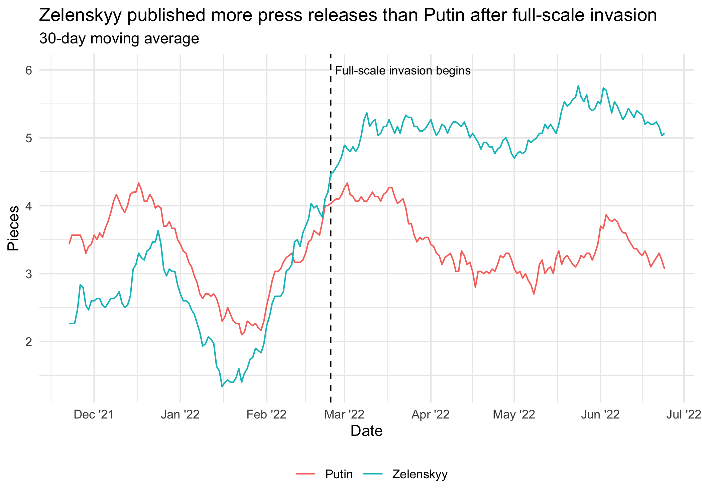
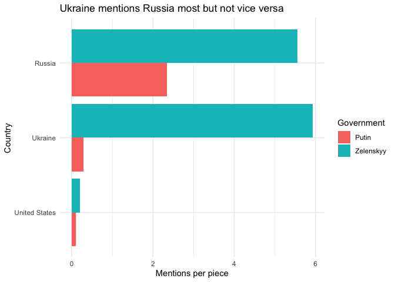
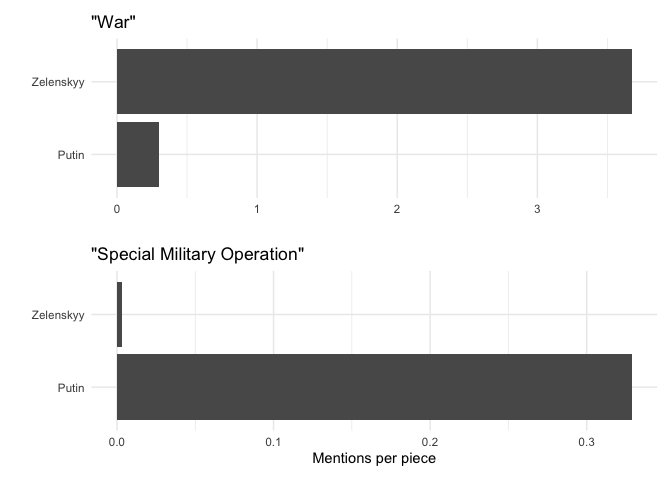
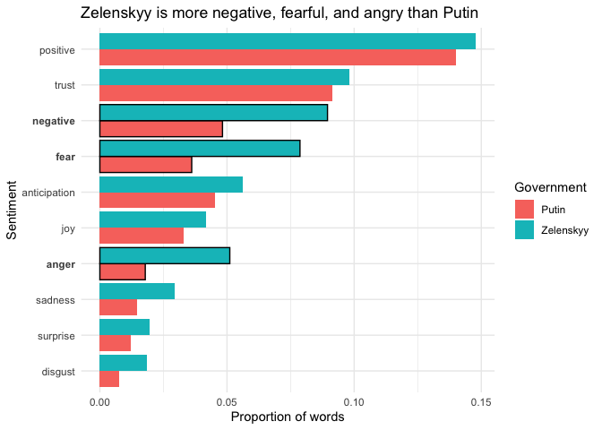
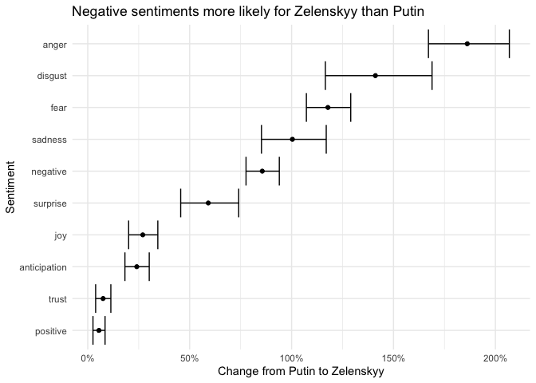

``` r
library(countrycode)
library(tidyverse)
```

    ## ── Attaching packages ─────────────────────────────────────── tidyverse 1.3.1 ──

    ## ✓ ggplot2 3.3.5     ✓ purrr   0.3.4
    ## ✓ tibble  3.1.6     ✓ dplyr   1.0.8
    ## ✓ tidyr   1.2.0     ✓ stringr 1.4.0
    ## ✓ readr   2.1.2     ✓ forcats 0.5.1

    ## ── Conflicts ────────────────────────────────────────── tidyverse_conflicts() ──
    ## x dplyr::filter() masks stats::filter()
    ## x dplyr::lag()    masks stats::lag()

``` r
library(lubridate)
```

    ## 
    ## Attaching package: 'lubridate'

    ## The following objects are masked from 'package:base':
    ## 
    ##     date, intersect, setdiff, union

``` r
library(patchwork)
library(tidytext)
library(scales)
```

    ## 
    ## Attaching package: 'scales'

    ## The following object is masked from 'package:purrr':
    ## 
    ##     discard

    ## The following object is masked from 'package:readr':
    ## 
    ##     col_factor

``` r
library(here)
```

    ## here() starts at /Users/peiyizhuo/zelenskyy-putin

## Analyzing Press Releases from Zelensky and Putin

We obtained the data for this final analysis by scraping the news
sections of the English language websites of [the President of
Ukraine](https://www.president.gov.ua/en/news/all) and [the
Kremlin](http://en.kremlin.ru/events/president/news). The pieces we
scraped are dated from February 24, 2022, the day that Russia launched
their latest assault on Ukraine, to April 27, 2022. Thus, these pieces
encompass the announcements made by the two leaders over the initial two
months of the conflict.

According to our analysis, which is modeled after [David Robinson’s
analysis on Trump tweets](http://varianceexplained.org/r/trump-tweets/),
Zelenskyy’s press releases demonstrate more concern about the war in
Ukraine than do the press releases of the Kremlin. Moreover, in light of
the results of our analysis of headlines, Zelenskyy’s heightened sense
of alarm over the war relative to Putin appears to be reflected in
Western media’s intense interest in the conflict.

``` r
# https://community.rstudio.com/t/error-message-bad-restore-file-magic-number-file-may-be-corrupted-no-data-loaded/48649
zelensky <- read_rds(here("press_release_data", "zelensky.rds"))
putin <- read_rds(here("press_release_data", "putin.rds"))
```

``` r
putin <- putin %>%
  mutate(
    # Combine press release summary with text
    text = ifelse(summary != "", paste(summary, text), text),
    origin = "putin"
  ) %>%
  select(-c(location, summary))

zelensky <- mutate(zelensky, origin = "zelensky") 

articles <- zelensky %>%
  rbind(putin) %>%
  mutate(text = ifelse(headline != "", paste(headline, text), text)) 
```

### Press Release Volume Over Time

After combining the two data sets corresponding to Zelenskyy press
releases and Putin press releases, we made the plot below. Each
observation in the combined data set is associated with a piece from
either Zelenskyy’s or Putin’s website.

``` r
pieces_by_day <- articles %>%
  mutate(
    date = date(date),
    origin = ifelse(origin == "putin", "Putin", "Zelenskyy")
  ) %>%
  group_by(date, origin) %>%
  count()

pieces_by_day %>%
  ggplot(aes(x = date, y = n)) +
    geom_line(size = 0.4) +
    labs(
      x = "Date",
      y = "Pieces",
      title = "Zelenskyy publishes more press releases on average than Putin"
    ) +
    geom_smooth(method = lm, formula = y ~ 1, se = FALSE, size = 0.4, linetype = "dashed", color = "red") +
    facet_wrap(~ origin, nrow = 1) +
    guides(color = guide_legend("Government")) +
    theme_minimal()
```

<!-- -->

Zelenskyy’s busiest day for press releases was Feburary 24, the day
Russia invaded his country. Meanwhile, the busiest day for announcements
from Putin was April 12, the day he visited a cosmodrome, an event that
is unrelated to the war in Ukraine. This could be seen as an indication
of the messaging priorities of the two leaders. While Zelenskyy is
attempting to raise the alarm regarding the threat to his country, Putin
is attempting to downplay the conflict through both the volume and the
content of his press releases.

### Countries Mentioned in Press Releases

Using the `codelist` of names provided by the `countrycode` package, we
were able to determine the top 10 most-mentioned countries for Zelenskyy
and Putin respectively. These two lists have 6 nations in common.

``` r
# Regular expression of countries
countries <- paste(codelist$country.name.en, collapse = "|")

mentioned_countries <- articles %>%
  mutate(countries = str_extract_all(text, countries)) %>%
  select(origin, headline, countries) %>%
  unnest_longer(countries) %>%
  group_by(origin, countries) %>%
  summarize(n = n() / length(unique(.$headline))) %>%
  do(head(arrange(., desc(n)), 10)) 
```

    ## `summarise()` has grouped output by 'origin'. You can override using the
    ## `.groups` argument.

``` r
zelensky_countries <- mentioned_countries %>%
  filter(origin == "zelensky") %>%
  pull(countries)

putin_countries <- mentioned_countries %>%
  filter(origin == "putin") %>%
  pull(countries)

top_countries <- zelensky_countries[zelensky_countries %in% putin_countries]

mentioned_countries %>%
  mutate(origin = ifelse(origin == "putin", "Putin", "Zelenskyy")) %>%
  filter(countries %in% top_countries) %>%
  ggplot(aes(y = reorder(countries, n), x = n, fill = origin)) +
  geom_bar(stat = "identity", position = "dodge") +
  labs(
    x = "Mentions per piece",
    y = "Country",
    title = "Ukraine mentions Russia most but not vice versa"
  ) +
  guides(fill = guide_legend("Government")) +
  theme_minimal()
```

<!-- -->

The above plot displays the countries that are among the top 10
most-mentioned for both Zelenskyy and Putin. Zelenskyy mentions Russia
the most with Ukraine coming in close behind. However, Putin does not
return the favor. Instead of mentioning Ukraine the most, the Kremlin
prefers to talk about itself, at a rate far ahead of references to its
neighbor. This discrepancy points again to an attempt, on the part of
Putin, to downplay the conflict. While Zelenskyy is hyper-focused on his
enemy, Russia, Putin shows less interest in discussing Ukraine despite
the fact that Russia is waging an active war in that country.

### The Use of “War” vs. “Special Military Operation”

``` r
words <- articles %>%
  unnest_tokens(word, text) %>%
  anti_join(stop_words, by = "word")
```

A much-discussed aspect of Russian messaging about the conflict has been
their refusal to describe it as a war, instead using the term “special
military operation.” By contrast, Zelenskyy does not seem to have an
issue with using the word “war.” The use of obfuscating language by
Putin contributes additional evidence in support of the claim that he is
minimizing the war.

``` r
war <- words %>%
  mutate(origin = ifelse(origin == "putin", "Putin", "Zelenskyy")) %>%
  group_by(origin) %>%
  summarize(
    mentions_per_article = sum(word == "war") / length(unique(headline))
  ) %>%
  ggplot(aes(x = mentions_per_article, y = origin)) +
  geom_bar(stat = "identity") +
  labs(
    x = "",
    y = "",
    title = '"War"'
  ) +
  theme_minimal()

smo <- articles %>%
  mutate(origin = ifelse(origin == "putin", "Putin", "Zelenskyy")) %>%
  mutate(
    # https://github.com/rstudio/cheatsheets/blob/main/strings.pdf
    smo = str_count(text, "special military operation|Special military operation")
  ) %>%
  group_by(origin) %>%
  summarize(
    mentions_per_article = sum(smo) / n()
  ) %>%
  ggplot(aes(x = mentions_per_article, y = origin)) +
  geom_bar(stat = "identity") +
  labs(
    x = "Mentions per piece",
    y = "",
    title = '"Special Military Operation"'
  ) +
  theme_minimal()

war / smo
```

<!-- -->

After using `unnest_tokens` from the `tidytext` package to create a data
set of words and eliminating stop words (“the”, “and”, “so”, etc.) from
the data set, we found that this verbal distinction between the two
leaders is apparent in their press releases.

### Sentiment Analysis

``` r
# https://www.tidytextmining.com/sentiment.html
nrc <- get_sentiments("nrc")
words <- words %>%
  add_count(origin) %>%
  left_join(nrc, by = "word") %>%
  group_by(origin, sentiment, total = n) %>%
  count(name = "number") %>%
  filter(!is.na(sentiment)) 
```

Using the data set of words created in the previous section, we were
able to conduct a comparison of the sentiments found in the Zelenskyy
and Putin press releases along the lines of the one that David Robinson
conducted on iPhone and Android tweets from Donald Trump’s Twitter
timeline.

``` r
words %>%
  mutate(origin = ifelse(origin == "putin", "Putin", "Zelenskyy")) %>%
  ggplot(
    aes(
      # https://stackoverflow.com/questions/5208679/order-bars-in-ggplot2-bar-graph
      x = number / total, 
      y = reorder(sentiment, number / total),
      fill = origin,
      color = sentiment %in% c("negative", "fear", "anger")
    )
  ) +
  scale_color_manual(values = c("transparent", "black")) +
  geom_bar(stat = "identity", position = "dodge") +
  labs(
    x = "Proportion of words",
    y = "Sentiment",
    title = "Zelenskyy is more negative, fearful, and angry than Putin"
  ) +
  guides(
    color = "none",
    fill = guide_legend("Government")
  ) +
  theme_minimal() +
  theme(
    # https://stackoverflow.com/questions/20609716/changing-format-of-some-axis-labels-in-ggplot2-according-to-condition
    axis.text.y = element_text(
      face = c("plain", "plain", "plain", "bold", "plain", "plain", 
               "bold", "bold", "plain", "plain", "plain")
    )
  )
```

    ## Warning: Vectorized input to `element_text()` is not officially supported.
    ## Results may be unexpected or may change in future versions of ggplot2.

<!-- -->

There are dramatic differences between Zelenskyy and Putin in terms of
the proportions of their words that connote negative, fearful, and angry
sentiments respectively. Zelenskyy is more likely to display all three
of these sentiments. Results from Poisson tests (visualized below)
confirm this finding as statistically significant.

``` r
words %>%
  group_by(sentiment) %>%
  # https://www.datasciencemadesimple.com/reverse-the-order-of-dataframe-row-wise-2/
  .[nrow(.):1, ] %>%
  do(tidy(poisson.test(.$number, .$total))) %>%
  mutate(across(c(estimate, starts_with("conf")), ~ . - 1)) %>%
  ggplot(aes(x = estimate, y = reorder(sentiment, estimate))) +
  geom_point() +
  geom_errorbar(aes(xmin = conf.low, xmax = conf.high)) +
  scale_x_continuous(labels = label_percent()) +
  labs(
    x = "Change from Putin to Zelenskyy",
    y = "Sentiment",
    title = "Negative sentiments more likely for Zelenskyy than Putin"
  ) +
  theme_minimal()
```

<!-- -->

Zelenskyy’s press releases are 3 times more likely to use angry words
than Putin’s. Zelenskyy’s outrage in contrast to Putin’s blase attitude
is indicative of each leader’s willingness (or lack thereof in the case
of Putin) to display alarm over the conflict. It makes sense that
Zelenskyy, given the state of emergency into which his country has been
plunged, would project negative sentiments in his communications. Such a
strategy is more likely to alert international allies of the severity of
Ukraine’s plight. Putin, on the other hand, having initiated the
conflict, probably wants to give the impression that the situation is
under control and is therefore apt to downplay the events of these past
two months.

Additional Sources:

1.  <https://intro2r.com/r-markdown-anatomy.html>
2.  <https://bookdown.org/yihui/rmarkdown/markdown-syntax.html>
3.  <https://bookdown.org/yihui/rmarkdown-cookbook/font-color.html>
4.  <https://onlinelibrary.wiley.com/doi/abs/10.1111/j.1467-8640.2012.00460.x>
